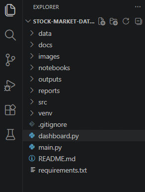
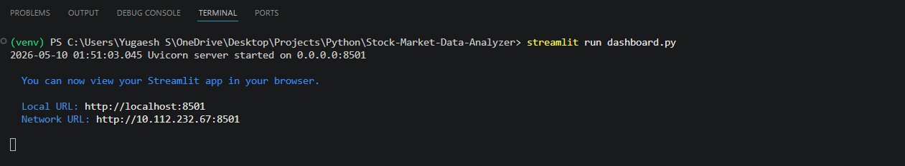
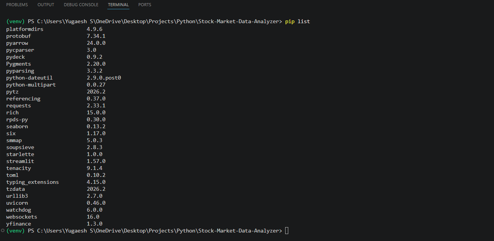
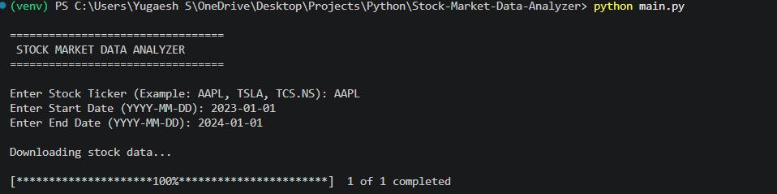
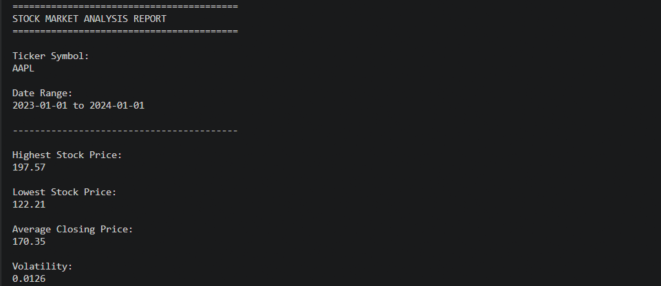
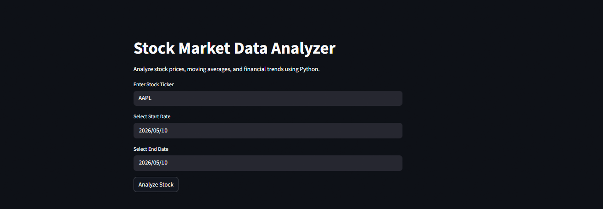

# 📈 Stock Market Data Analyzer

A complete Python-based financial analytics project that fetches real-time stock market data, performs stock trend analysis, calculates moving averages, analyzes volatility, and generates professional visualizations and reports.

This project is designed for:
- Python Developer roles
- Data Analyst roles
- Financial Analyst roles
- FinTech projects
- Portfolio & GitHub proof

---

# 🚀 Project Overview

The Stock Market Data Analyzer helps users analyze historical stock market data using Python.

The system:
- fetches stock data using Yahoo Finance API
- cleans and processes financial datasets
- calculates moving averages
- calculates daily returns
- measures volatility
- generates charts and reports
- provides interactive dashboard visualization

---

# 🏢 Industry Relevance

Financial institutions, investment firms, FinTech companies, and analysts use stock market analytics systems to:
- track stock performance
- identify market trends
- measure investment risk
- perform technical analysis
- support investment decision-making

This project demonstrates practical industry-level skills such as:
- API integration
- financial data analysis
- time-series analytics
- data visualization
- dashboard development
- automated reporting

---

# 🛠️ Tech Stack

| Technology | Purpose |
|---|---|
| Python | Core Programming |
| Pandas | Data Analysis |
| NumPy | Numerical Computation |
| Matplotlib | Data Visualization |
| Seaborn | Statistical Visualization |
| yfinance | Stock Market API |
| Streamlit | Interactive Dashboard |
| VS Code | Development Environment |
| Git & GitHub | Version Control |

---

# 📂 Project Structure

```bash
Stock-Market-Data-Analyzer/
│
├── data/
├── notebooks/
├── src/
├── outputs/
├── images/
├── reports/
├── docs/
├── screenshots/
├── venv/
├── main.py
├── dashboard.py
├── README.md
├── requirements.txt
└── .gitignore
```

---

# ⚙️ Features

✅ Real-time stock market data fetching  
✅ Historical stock analysis  
✅ Daily return calculation  
✅ Moving average analysis  
✅ Volatility analysis  
✅ Financial report generation  
✅ CSV export functionality  
✅ Professional visualizations  
✅ Interactive Streamlit dashboard  
✅ GitHub-ready project structure  

---

# 📊 Workflow

```text
User Input
    ↓
Fetch Stock Data
    ↓
Data Cleaning
    ↓
Return Analysis
    ↓
Moving Average Analysis
    ↓
Volatility Calculation
    ↓
Visualization
    ↓
Report Generation
```

---

# 📥 Installation

## Step 1 — Clone Repository

```bash
git clone https://github.com/your-username/Stock-Market-Data-Analyzer.git
```

---

## Step 2 — Navigate to Project Folder

```bash
cd Stock-Market-Data-Analyzer
```

---

## Step 3 — Create Virtual Environment

### Windows

```bash
python -m venv venv
```

---

## Step 4 — Activate Virtual Environment

### PowerShell

```powershell
.\venv\Scripts\Activate.ps1
```

---

## Step 5 — Install Dependencies

```bash
pip install -r requirements.txt
```

---

# ▶️ Run Main Project

```bash
python main.py
```

---

# 🌐 Run Streamlit Dashboard

```bash
streamlit run dashboard.py
```

---

# 📈 Sample Analysis

Example Inputs:

```text
Ticker: AAPL
Start Date: 2023-01-01
End Date: 2024-01-01
```

Generated Outputs:
- stock price charts
- moving average analysis
- volatility analysis
- return distribution chart
- processed CSV files
- financial reports

---

```markdown

# 📷 Screenshots

## 1️⃣ Project Folder Structure

Professional project folder structure created using VS Code.



---

## 2️⃣ Virtual Environment Setup

Python virtual environment successfully activated for dependency management.



---

## 3️⃣ Library Installation

Required Python libraries installed successfully for financial analytics and visualization.



---

## 4️⃣ Stock Data Download

Real-time stock market data fetched successfully using the Yahoo Finance API.



---

## 5️⃣ Terminal Analysis Output

Complete terminal execution displaying stock analysis results and generated insights.



---

## 6️⃣ Processed Stock Dataset

Processed dataset containing stock prices, moving averages, and daily return calculations.


---

## 7️⃣ Moving Average Analysis Chart

Visualization of stock closing prices with 20-Day and 50-Day moving averages.


---

## 8️⃣ Daily Returns Distribution Chart

Statistical distribution analysis of daily stock returns with KDE visualization.


---

## 9️⃣ Generated Financial Report

Automatically generated financial report containing volatility and stock insights.


---

## 🔟 Output Files

Generated project outputs including CSV files, reports, and chart visualizations.


---

## 1️⃣1️⃣ Streamlit Dashboard Home

Interactive Streamlit dashboard home interface for stock market analysis.



---

## 1️⃣2️⃣ Streamlit Dashboard Analysis

Dashboard displaying stock charts, moving averages, and financial metrics.


---

## 1️⃣3️⃣ GitHub Repository Preview

GitHub repository preview containing project files, documentation, and screenshots.


# 📌 Key Financial Concepts Used

## Moving Average
Used to identify stock price trends over time.

## Daily Return
Measures daily stock performance changes.

## Volatility
Measures risk and stock price fluctuations.

## Technical Analysis
Helps analyze historical market behavior.

---

# 💡 Learning Outcomes

Through this project, I learned:
- financial data analysis
- API integration using Python
- time-series analysis
- data visualization
- dashboard development
- debugging and data cleaning
- GitHub project management
- professional documentation

---

# 🔥 Future Improvements

- Real-time stock tracking
- Portfolio analysis
- AI-based stock prediction
- Email alerts
- Advanced technical indicators
- Multi-stock comparison dashboard

---

# 👨‍💻 Author

Yugaesh S

---

# ⚠️ Disclaimer

This project is created for educational and learning purposes only.

It should not be considered financial or investment advice.
